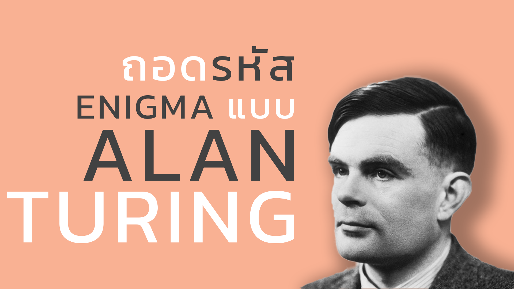

## About The Bombe Machine

_TheBombeMachine_ - a project that simulates a bombe machine using python to decrypt a text from an enigma machine.

In this project, I built a bombe machine to commemorate Alan Turing on his birthday. The principle is to brute-force the settings of the enigma machine over and over to find the resulting text that matches some of the plaintext we know.

## Youtube

For more information can be seen in my [video](https://youtu.be/mVP7KlRnhkA) on YouTube.

[]("https://youtu.be/mVP7KlRnhkA")

## Requirements

- Python 3
- Git

## Install

```
git clone https://github.com/TitorPs360/the-bombe-machine
pip install py-enigma
```

## Usage

1. Open CMD or Terminal

   

2. Enter ciphertext and cribtext (few plaintext that you know)

   

3. Wait for it to brute-force

   

   
